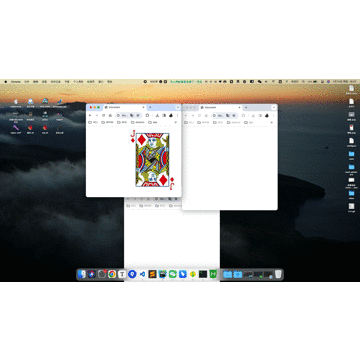

## 预览
- 运行index.html
- 给浏览器添加不同参数 
  - `http://localhost:8080/index.html?card=j`
  - `http://localhost:8080/index.html?card=q`
  - `http://localhost:8080/index.html?card=k`
- 显示不同的卡牌

## 效果图如下：

两个浏览器窗口

三个浏览器窗口

